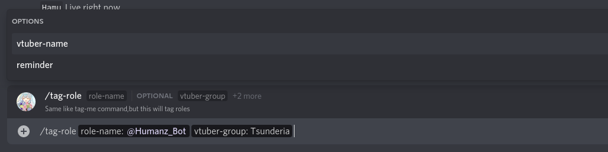
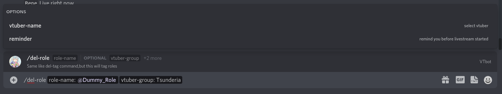
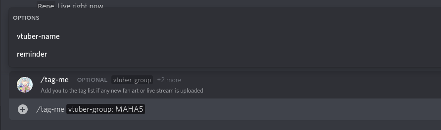
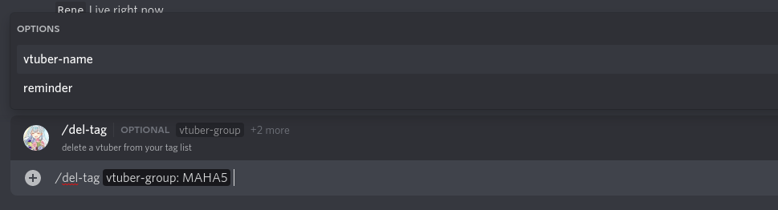

## VTbot setup guide 

## Simple Setup
First create a channel for this bot,Example `holosimps_channel`
then execute `/setup` for setup or you can setup it from [web](https://web-admin.humanz.moe/Login)

## Setup bot to ping roles
After you create and enable channel you can setup bot for ping some roles if any new livestream from vtubers  
for example you can exec like this   

you only can choice one options,`vtuber-group` or `vtuber-member` the `reminder` was optional,if you add `reminder` the bot will ping you or your roles the time before livestream started, if you set 5 that means you will be pinged 5 minutes before livestream started 

## Remove roles from ping list

Permission requirement : **Manage channel or higher**
-----------------------------------------------------------------------------------------------------

## Setup bot to ping you
the options still same like ping roles

## Remove you from ping list

Permission requirement : None
-----------------------------------------------------------------------------------------------------